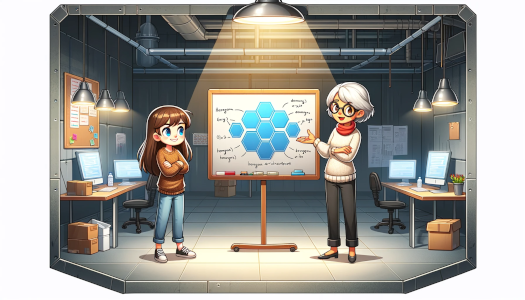

Det var en gång en ung flicka som alltid varit nyfiken, ända sedan hon lärde sig prata. Hennes far var från ett land
långt bort och pratade engelska. Han hade fått en sträng uppfostran och tyckte att hon var alldeles för frågvis.

– All you do is ask, ask and then ask some more, brukade han utbrista.
  Det var så hon fick smeknamnet Askungen.

När Askungen blivit stor och gått ut skolan började arbeta så var det som programmerare. Hon visste att det fanns många
tillfällen till arbete i yrket men som oerfaren var det svårt ändå. Till sist fick hon jobb på det stora bolaget AB Bank
och Försäkringsförvaltning, BOFF.

BOFF hade varit med länge, nästan lika länge som det funnits datorer på kontor. Ledningen på företaget tyckte att IT var
mest en nödvändighet, lite som kontorsmöbler och handläggare.

Askungen fick ta över ett system som skötte väldigt mycket. Systemet var gammalt och de som skrev det från början hade
slutat eller gått in i väggen. Koden var skriven i ett gammalt språk som utvecklats över åren så olika delar av koden
var skriven på det sättet som var aktuellt inom språket på den tiden.

Inte nog med det, även ramverken som hörde till språket och idéer inom arkitektur hade varierat över tiden, vilket
påverkat systemet märkbart. Att läsa koden var som en arkeologisk utgrävning med skikt från varje tidsålder.

Många av företagets affärsregler fanns utspridda i koden, blandat med tekniska detaljer. Det fanns en del tester men
många var mest för att testa implementationen, inte affärslogiken. När man försökte ändra i koden så rätt som det var
hoppade ett test upp och klagade högljutt.

Askungen satt oftast ensam och försökte läsa koden. Men hon fick ingen rast eller ro för ständigt dök det upp
intressenter som ville ha ändringar och tillägg i systemet.

– Askungen, kunde de ropa så fort hon gick för att ta sitt kaffe, vi vill ha en ny rapport!

Askungen blev ofta förvirrad när hon försökte förstå vad intressenterna ville. Dels fanns inte de begrepp som de använde
representerade i koden hon hade läst och dels verkade det som att intressenterna var oense om vad begreppen betydde.

– Exponering, kunde en säga ena dagen och mena något om lån. Nästa dag handlade det om investeringar och tredje dagen
var det marknadsföring.
Den stora Mässan
En dag kom det ett bud från företagsledningen om att BOFF skulle vara utställare på en stor mässa. Här gällde det att
glänsa och visa hur modernt företag man var så att man kunde attrahera nya kunder men framförallt ville man imponera på
riskkapitalisterna. Då kunde det bli ett rejält tillskott i kassan.

Askungen, som var en utåtriktad person, ville förstås vara med på mässan och hjälpa till med utställningen. Hon ville så
gärna stå där och träffa de som använde systemet, prata lite och se vad de tyckte.

Dessutom hade hon en fantastisk idé som hon ville demonstrera där. En idé som skulle göra användarna glada och företaget
framgångsrikt.

Problemet var att hon aldrig hade tid att arbeta med sin idé. Det var ständiga krav från intressenterna om än det ena
och än det andra. Varje sak tog lång tid att realisera för koden var så rörig och omfattande.

– Nåja, suckade Askungen, vad är en mässa? Den kan ju vara fruktansvärt långtråkig och dötrist och … underbar.
En god fé
Dagen därpå var det en fika för att fira att en chef fyllde jämnt, förmodligen hans enda prestation de senaste åren.
Några som gått i pension var också inbjudna för att de kände honom så väl.

Askungen satte sig bredvid en äldre kvinna och suckade.

– Du måste vara den nya programmeraren, sa den äldre kvinnan, du jobbar med systemet jag var med och skrev. Askungen log
lite snett.

– Jag heter Felicia, fortsatte kvinnan och gav ett varmt leende tillbaka.

Askungen satt tyst och visste inte vad hon skulle säga till kvinnan som var medskyldig till att koden såg ut som den
gjorde. Felicia tittade en stund på Askungen, sen sa hon:

– Jag vet hur koden ser ut, det är inget jag är stolt över. Men som pensionär har jag hunnit läsa mycket och fundera.
Jag tror att jag skulle kunna hjälpa dig.

Felicia hade läst om två saker som hon trodde på, en om hur man väljer att dela in sitt system och en om hur man
utformar varje del.

Efter fikat gick de båda till ett mötesrum som förvånansvärt nog var ledigt, kanske för att det låg i källaren och
saknade fönster. Men det hade flera stora tavlor att rita på.
Dela in och dela upp

– Vi börjar med den stora bilden, sa Felicia. Du har säkert märkt att intressenterna använder samma ord för olika
begrepp. Askungen nickade.

– Anledningen är att de har olika kontext, förklarade den äldre kvinnan, och att de inte är vana att uttrycka sig så
precist som en programmerare gör.

– Om vi delar in systemet efter dessa kontext, verksamhetsområden eller domäner, så kommer det underlätta. Varje kontext
får ha sitt eget språk som bara gäller där, ett ord kan stå för ett begrepp i ett kontext och för ett annat i en annan
kontext.

– Det blir mycket att hålla reda på, inflikade Askungen.

– Det är mycket att hålla reda på, det är därför vi behöver sådana här idéer, replikerade Felicia.

– Men hur ska jag få till det här, undrade Askungen.

– Börja med att försöka ta fram några kontext som är uppenbara, kom svaret. Sedan ritar vi en kontextkarta där det vi
känner till finns med. Vi markerar vilka som är uppströms respektive nedströms till varandra.

– Vad menas med det, utbrast Askungen undrande.

– Det är beroende mellan kontexter, när vi behöver ändra i en kontext som en annan är nedströms till, så är det alltid
den som är nedströms som ansvarar för att hantera ändringen. Den som är uppströms kan inte ta hänsyn till alla som är
beroende av den, då skulle den stå still. Istället är det de som är nedströms som får skydda sig med det som kallas för
antikorruptionslager.

– Kan man inte bara ha stabila gränssnitt, invände Askungen. Felicia log lite.

– Det är svårt att göra förändringar om allt ska vara stabilt, kom det med lätt ironi i rösten. Hon hade fått upp en
härlig energi.

– Då förstår jag principen för hur jag ska hålla isär allting, reflekterade Askungen. Jag antar att det är bra att bara
bryta ut en kontext i taget, bit för bit.

– Absolut, det är aldrig en bra idé att försöka skriva om allt på en gång. Det har jag sett misslyckas så många gånger.
Hålla isär
Felicia tittade Askungen i ögonen.

– Är du beredd för nästa steg, frågade hon.

– Jag vet inte, jag förstår det du sagt men vad gör jag i varje kontext? Askungen hade djupa veck i pannan.

– Det är det som är nästa steg, förklarade Felicia, nu ska du hålla isär de tekniska hänsynen från de affärslogiska. Vi
lyssnade på en gubbe som heter Erik och nu blir det en annan som heter Alistair.

– Jaha, men vad gör jag då? Askungen kände att huvudet började bli överfullt och nu skulle det komma fler idéer att ta
in. Felicia ritade en hexagon på tavlan.

– Bry dig inte om att det är en hexagon, inledde hon, det viktigaste är vad som finns i den, portar, adapter och domänen
i mitten, eller applikationen som författaren skulle sagt.

– Jaha, vad ska det vara bra för, det blir ju en massa meck av det där, sa Askungen i en lite trött ton.

– Båda de här tekniker syftar till att göra systemet läsbart, både på systemnivå och kodnivå, förklarade Felicia. Det
bidrar till att systemet blir lättare att underhålla.

– När det gäller det hexagonala mönstret så är det så här, fortsatte hon med en intensiv röst. Portarna definierar
protokoll och gränssnitt som kan implementeras av flera adaptrar. Detta gör systemet mer testbart eftersom en port kan
implementeras av en adapter som bara är till för test. Till exempel kan en databas bara vara något flyktigt i minnet som
kan sättas i vilket tillstånd som helst. Eller en simulering av en användare som klickar utan att ta till dedikerade
verktyg som simulerar en webbläsare.

Askungen tänkte på en del av de försök av den typen som lämnat spår i systemet i form av tester som alltid var avstängda
för att klickandet ofta gick snett. Hon tänkte också på de snåriga tester som använde en databas för att kunna testa
affärslogik. De gick ofta snett när testerna påverkade varandra via databasen.

– Är vi framme vid koden snart? Askungen lät som ett otåligt barn på en längre bilresa.

– Ja, precis nu, sa Felicia med sitt varma leende. Nu när vi har de här idéerna så ska vi realisera dem med en lämplig
kodstruktur. Som du ser på tavlan så har hexagonen tre delar. Till vänster har du den drivande sidan, eller primära om
man så vill. Längst till höger har vi den drivna eller sekundära. Dessa har sina portar och adaptrar. Mitt emellan
ligger domänen med affärslogiken och dess begrepp.

– Ska jag lägga alla portarna tillsammans, föreslog Askungen och sträckte sig efter en penna att rita på tavlan med.

– Nej, det tycker jag inte, invände Felicia, börja med att dela in i de tre delarna primär, sekundär och domän. Jag
skulle föreslå namnen “in”, “out” och "domain". Det blir kort och bra.

– Sedan inom “in” och “out” så gör du ytterligare en indelning i “port” och “adapter”, fortsatte hon. I “port” lägger du
de gränssnitt som implementeras i "adapter".

